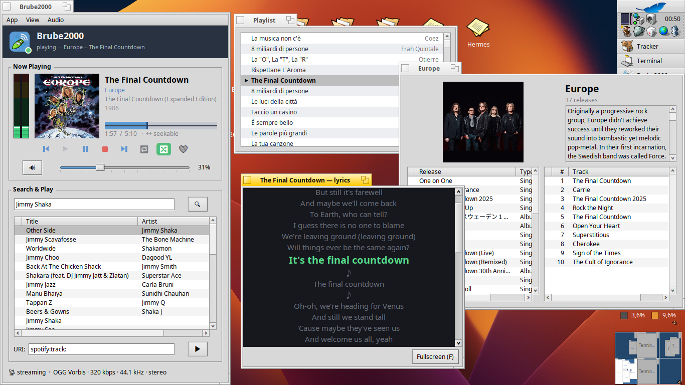

# Brube2000

Native **Haiku** music client written in C++, for **Spotify** (and **Tidal**,
beta). It reimplements the
[librespot](https://github.com/librespot-org/librespot) protocol core from
scratch (Shannon cipher, Diffie-Hellman handshake, Mercury, AES-128-CTR audio
decryption) and builds entirely on Haiku's own kits — Media Kit for audio,
Interface Kit for the GUI, Network Kit for transport. Backends plug in behind a
single interface, so the same UI drives both services.



> Reverse-engineering project for interoperability, modelled on librespot.
> Requires a **Spotify Premium** account. Not affiliated with Spotify AB.

If Brube2000 saves you time, consider supporting development: [](https://buymeacoffee.com/atomozero)

## Features

* Native Haiku GUI — no Electron, no web view, just the system kits
* **Single sign-in**: one OAuth login unlocks playback, search and your library
* Streaming playback that starts in ~2 seconds — the track downloads in the
  background instead of waiting for the whole file
* **Seekable** progress bar with a buffer/download indicator and a
  full-duration reference line (seek unlocks once the track is fully buffered)
* Persistent play queue that survives restarts, with auto-advance and prev/next
* Your **library** — liked songs and playlists — through Spotify's internal
  endpoints, with no second login
* Browse by **artist** (popular tracks, albums, singles) and by **album**
  (full track list), all clickable from the Now Playing pane
* Search tracks, artists and albums in a native results table; double-click to
  play, double-click an artist to open their page
* Synced **lyrics** with a fullscreen **karaoke** mode that follows the track
  line by line
* **Winamp-style keyboard shortcuts** (Z/X/C/V/B, arrows for volume & seek,
  L to search, M to mute) plus **repeat** and **shuffle** with header indicators
* Winamp-style **PL** and **LIB** toggle buttons for the playlist and library
  windows, lit while their window is open
* **VU meter** tied to the volume fader, and the album cover openable in its own
  full-resolution window
* **OGG Vorbis, FLAC and AAC** decoding, so lossless backends play natively
* Selectable audio **quality** (96 / 160 / 320 kbps OGG Vorbis on Spotify)
* Selectable audio **output**: BSoundPlayer (default) or an experimental Cortex
  Media Kit node — the app shows up in Cortex either way
* **Remote control** — a native BeOS scripting interface lets Haiku's `hey`, the
  [Pippo](https://github.com/atomozero/Pippo) MCP server or an LLM read state and
  drive playback. Off by default, with separate opt-in permission levels for the
  `hey` and MCP channels (see [docs/scripting.md](docs/scripting.md))
* Settings organised in **tabs** (Spotify / Tidal / General)
* No dependencies beyond Haiku system libraries, OpenSSL, protobuf, libvorbis,
  libFLAC and libjpeg

## Tidal (beta)

Brube2000 also speaks **Tidal**. Switch backend from **App → Music service →
Tidal**, then **App → Sign in to Tidal…** and either open the link or **scan the
QR code with your phone** (no browser needed on the Haiku box). Once signed in
you can search, browse artists and albums, see your library and cover art —
all natively.

**Playback needs a Tidal Premium/HiFi subscription.** A free account can browse
and see metadata/covers, but streaming a full track requires a paid plan
(Tidal returns "asset not ready" otherwise). Lossless FLAC playback is wired up
and awaiting wider testing on paid accounts.

## Quick start

### GUI (recommended)

```
./build-app.sh
./Brube2000
```

On first launch, if there's no saved token the **Settings** window opens so you
can sign in. After that the player logs in automatically, streams tracks and
advances through the queue on its own.

### Sign in — the only login

Open **App → Account & Settings…** and click **"Sign in with Spotify…"**. This
runs an OAuth 2.0 PKCE flow: your browser opens `accounts.spotify.com/authorize`,
and after you approve, Spotify redirects to `http://127.0.0.1:5588/login`, where
a tiny local server catches the code, exchanges it for an access token and
authenticates the session. The token is cached in
`~/config/settings/Brube2000/`, so later launches sign in instantly. Streaming
requires a **Premium** account.

The same login also unlocks your library — no second sign-in.

### Search — optional one-time setup

Search uses Spotify's Web API through **your own free registered app** (this is
an API key, *not* a second login):

1. Create an app at https://developer.spotify.com/dashboard
2. Put its Client ID and Client secret (two lines) in
   `~/config/settings/Brube2000/webapi`, or paste them into
   **Account & Settings… → Search keys** (the secret field is masked).

Then type in the **Search** box, press Enter, and double-click a result to play
it. Playback goes through your Premium session; search goes through your Web API
app.

### Library, artists & albums

Open **View → Library** to load your liked songs and playlists (fetched over the
authenticated session, so nothing extra to configure). Double-click a playlist to
play the whole thing. Click an artist's name anywhere to open their page —
popular tracks, albums and singles — and click an album to see its full track
list.

### Audio output (Cortex)

**Audio → Audio output** chooses the backend:

* **System (BSoundPlayer)** — the default. Clean, and it already appears as a
  "Brube2000" node in Cortex.
* **Cortex node (experimental)** — routes playback through `BrubeAudioNode`, a
  real `BBufferProducer` + `BMediaEventLooper` that registers with the
  media_server and connects to the system mixer, so Brube2000 becomes a
  first-class routable node. Feature-complete (seek, VU, volume, a decode-ahead
  ring buffer) but its low-level timestamp handling still needs work, so it is
  opt-in; if it sounds off, switch back to System.

## Install (package)

Build the Haiku package and install it:

```
sh make-hpkg.sh
pkgman install brube2000-1.2.0-1-x86_64.hpkg
```

## Build

Dependencies (already present on Haiku R1/beta5, otherwise `pkgman install`):
`protobuf_devel`, `openssl`, `libvorbis`.

```
make proto        # generate the protobuf C++ sources (run once)
./build-app.sh    # build the Brube2000 GUI app
make test         # compile and run the Shannon cipher cross-check
```

The protobuf `.cc` files are slow to compile, so they are precompiled to
`build/*.pb.o` once and linked from there; `build-app.sh` does the fast
incremental app build on top.

## How it works

```
  ┌─────────────────────────────────────────────┐
  │  GUI  (Interface Kit: BWindow, BColumnList…) │   src/gui/
  ├─────────────────────────────────────────────┤
  │  Player  (queue, streaming, seek, output)    │   src/core/
  ├─────────────────────────────────────────────┤
  │  Audio   AES-128-CTR → Vorbis → output       │   src/audio/, src/media/
  ├─────────────────────────────────────────────┤
  │  Mercury / metadata / library / audio keys   │   src/core/
  ├─────────────────────────────────────────────┤
  │  Session: DH handshake + auth + Shannon       │   src/core/, src/crypto/
  └─────────────────────────────────────────────┘
```

Audio pipeline:

```
encrypted chunks ─▶ AudioDecrypt (AES-128-CTR) ─▶ AudioSource ─▶ VorbisDecoder
                                                                 (libvorbisfile)
                                                                       │ int16 PCM
                                                                       ▼
                                          AudioPlayer (BSoundPlayer)  /  BrubeAudioNode
                                                       → media_server → speakers
```

### librespot (Rust) → Brube2000 (C++/Haiku)

| librespot | Brube2000 | Notes |
|---|---|---|
| `shannon` crate | `src/crypto/Shannon.*` | bit-identical to the Rust reference (312 vectors) |
| `core/src/connection` (handshake) | `src/core/Session.*` | DH via OpenSSL BIGNUM |
| `core/src/apresolve` | `src/net/ApResolve.*` | HTTPS via `BSecureSocket` |
| tokio async sockets | `BNetEndpoint` / threads | Haiku thread model |
| `librespot-audio` (AES-CTR) | `src/audio/AudioDecrypt.*` | OpenSSL `EVP_aes_128_ctr` |
| Vorbis (`lewton`) | `src/audio/VorbisDecoder.*` | native `libvorbisfile` |
| `rodio` / audio backend | `AudioPlayer` / `BrubeAudioNode` | Media Kit |
| protobuf (`prost`) | `src/proto/*.pb.*` | `protoc` + `libprotobuf` |

## Protocol notes

* **Shannon** stream cipher + MAC, verified byte-for-byte against the Rust
  reference used by librespot.
* **Diffie-Hellman** handshake with the access point, server signature check,
  and Shannon send/recv framing — a full end-to-end login against Spotify's
  production servers.
* **OAuth 2.0 PKCE** (RFC 7636) via a loopback server on port 5588; the access
  token authenticates the session and is reused for the library.
* **Mercury** (hermes) for track metadata, the AES audio key (`0x0c`/`0x0d`),
  and chunked audio download (AP StreamChunk `0x08`). Large metadata split
  across parts is reassembled.
* **Library** over internal endpoints on the authenticated session
  (`hm://collection/…`, `hm://playlist/v2/…`, `hm://metadata/3/…`), which avoids
  the public Web API's per-client rate limits — hence the single sign-in.
* Audio is decrypted with AES-128-CTR, the 167-byte Spotify header is stripped,
  and the resulting OGG Vorbis is decoded with libvorbisfile and played through
  the Media Kit.

## License

MIT. Copyright © 2026 atomozero. Reverse-engineering project for interoperability
with Spotify; not affiliated with Spotify AB. Requires your own Spotify Premium
account.

## Be careful
> **Developer's Note**: This software may contain traces of peanuts and LLM. It
> has been developed with passion for the Haiku platform.

## Support

If you find this project useful, you can buy me a coffee: [](https://buymeacoffee.com/atomozero)
